# 2.1 Transformer 详解

下面是 Transformer 核心架构的示意图，展示了 Encoder 和 Decoder 如何协同工作。

```plantuml
@startuml
!theme vibrant
title Transformer Architecture Overview

rectangle "Encoder (Nx)" as Encoder {
  rectangle "Multi-Head\nSelf-Attention" as EncAttention
  rectangle "Add & Norm" as EncNorm1
  rectangle "Feed Forward" as EncFF
  rectangle "Add & Norm" as EncNorm2
  
  EncAttention -> EncNorm1
  EncNorm1 -> EncFF
  EncFF -> EncNorm2
}

rectangle "Decoder (Nx)" as Decoder {
  rectangle "Masked Multi-Head\nSelf-Attention" as DecAttention
  rectangle "Add & Norm" as DecNorm1
  rectangle "Multi-Head\nCross-Attention" as CrossAttention
  rectangle "Add & Norm" as DecNorm2
  rectangle "Feed Forward" as DecFF
  rectangle "Add & Norm" as DecNorm3

  DecAttention -> DecNorm1
  DecNorm1 -> CrossAttention
  CrossAttention -> DecNorm2
  DecNorm2 -> DecFF
  DecFF -> DecNorm3
}

cloud "Inputs" as Inputs
cloud "Outputs" as Outputs
cloud "Output\nProbabilities" as Probs
database "Memory (K, V)" as Memory

Inputs -> Encoder
Encoder -> Memory
Memory -> CrossAttention

Outputs -> DecAttention
DecAttention -> CrossAttention
Decoder -> Probs

note top of Encoder: 处理输入序列，生成上下文表示
note top of Decoder: 结合上下文和已生成的部分，预测下一个词
note left of Memory: Encoder的输出，作为Decoder的记忆
@enduml
```

Transformer 架构由 Vaswani 等人在论文《Attention Is All You Need》中首次提出，现已成为几乎所有主流大语言模型的基础。其核心是完全抛弃了传统的循环（Recurrence）和卷积（Convolution）结构，完全依赖于注意力机制来捕捉输入和输出之间的全局依赖关系。

## 核心组件

### 1. Encoder-Decoder 架构

原始的 Transformer 模型包含两个主要部分：

*   **编码器 (Encoder)**: 负责将输入序列（如一种语言的句子）处理成一系列连续的表示（Context Vector）。它由多层相同的 Encoder Layer 堆叠而成。
*   **解码器 (Decoder)**: 负责接收编码器的输出和之前生成的部分输出序列，来生成下一个位置的输出。它也由多层相同的 Decoder Layer 堆叠而成。

### 2. 自注意力机制 (Self-Attention)

这是 Transformer 最核心的创新。自注意力机制允许模型在处理一个词时，同时关注到输入序列中的所有其他词，从而计算出这个词的上下文感知表示。

*   **Q, K, V (Query, Key, Value)**: 对于每个输入词向量，模型会学习三个独立的权重矩阵（`WQ`, `WK`, `WV`），将词向量分别映射成 Query、Key 和 Value 三个向量。
    *   **Query (Q)**: 代表当前词，用于去“查询”其他词。
    *   **Key (K)**: 代表序列中所有词的“键”，用于被 Q 查询。
    *   **Value (V)**: 代表序列中所有词的“值”，是词的实际内容表示。
*   **计算过程**:
    1.  **计算分数 (Score)**: 通过计算 Q 和所有 K 的点积，来衡量当前词与序列中其他词的关联程度。`Score = Q · K^T`
    2.  **缩放 (Scaling)**: 为了训练稳定性，将分数除以 Key 向量维度的平方根 (`sqrt(d_k)`)。
    3.  **Softmax**: 对缩放后的分数应用 Softmax 函数，得到一组权重系数，表示每个词对当前词的重要性。
    4.  **加权求和**: 将 Softmax 输出的权重与对应的 Value (V) 向量相乘并求和，得到最终的自注意力输出。

### 3. 多头注意力 (Multi-Head Attention)

多头注意力机制通过并行运行多个自注意力“头”（Head）来增强模型的表达能力。

*   **原理**: 模型不只学习一组 Q, K, V 的权重矩阵，而是学习多组（例如 8 组或 12 组）。每一组“头”可以独立地学习输入序列中不同方面的依赖关系（如语法关系、语义关系等）。
*   **过程**:
    1.  将输入的 Q, K, V 向量分别线性投射到多个低维空间。
    2.  在每个低维空间上并行计算自注意力。
    3.  将所有头的输出拼接（Concatenate）起来。
    4.  通过一次线性变换，将拼接后的结果映射回原始维度。

### 4. 位置编码 (Positional Encoding)

由于 Transformer 完全基于注意力机制，没有循环或卷积，它本身无法感知序列中词的顺序。为了解决这个问题，模型引入了位置编码。

*   **方法**: 在输入词嵌入（Word Embedding）的基础上，加入一个与位置相关的向量。这个向量是通过正弦（sin）和余弦（cos）函数生成的，能够为模型提供关于词在序列中绝对或相对位置的信息。

### 5. 前馈神经网络 (Feed-Forward Networks)

在每个 Encoder Layer 和 Decoder Layer 中，多头注意力的输出会经过一个简单的全连接前馈网络。

*   **结构**: 它由两个线性变换和一个 ReLU 激活函数组成。`FFN(x) = max(0, xW_1 + b_1)W_2 + b_2`
*   **作用**: 增加模型的非线性表达能力，对注意力机制的输出进行进一步的加工和提炼。

### 6. 残差连接 (Residual Connections) 与层归一化 (Layer Normalization)

这两个组件是训练深度 Transformer 模型的关键。

*   **残差连接**: 在每个子层（如多头注意力和前馈网络）的输入和输出之间添加一个直接连接（`x + Sublayer(x)`）。这有助于解决深度网络中的梯度消失问题，让网络更容易训练。
*   **层归一化**: 在每个子层的输出之后进行归一化操作。它稳定了每层的输入分布，从而加速了训练过程。