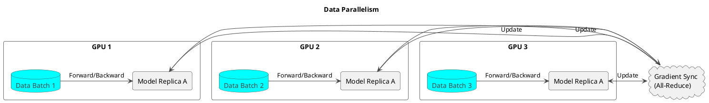
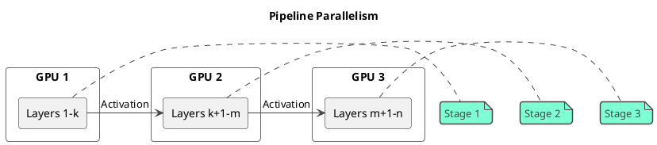
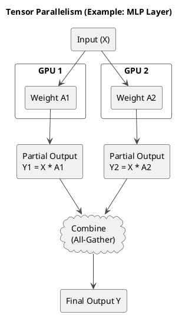

# 5.1 并行技术概述

当单个模型大到无法放入单个 GPU 显存，或者训练数据量巨大以至于单个 GPU 耗时过长时，就必须采用分布式训练。核心思想是将计算和存储任务拆分到多个设备（GPU）上。主要有三种并行策略：数据并行、张量并行和流水线并行。

## 1. 数据并行 (Data Parallelism)

这是最简单、最常见的并行策略。

*   **核心思想**: 每个 GPU 上都保存一份完整的模型副本。将总的训练数据批次（Global Batch）切分到每个 GPU 上，各个 GPU 独立计算梯度，然后通过一次 All-Reduce 操作同步所有梯度，最后每个 GPU 以相同的梯度更新自己的模型权重，从而保证所有副本保持一致。

*   **优点**: 实现简单，易于理解。
*   **缺点**: 无法解决模型过大无法放入单卡的问题，因为每个 GPU 都需要存储整个模型。

## 2. 流水线并行 (Pipeline Parallelism)

此策略解决了模型过大的问题，特别适用于层数很深的模型。

*   **核心思想**: 将模型的不同层（Layers）切分到不同的 GPU 上。数据像流水线一样，依次通过每个 GPU。第一个 GPU 完成第 1-k 层的计算后，将其输出传递给第二个 GPU，第二个 GPU 再进行后续层的计算，以此类推。

*   **优点**: 有效地将大模型切分到多张卡上。
*   **缺点**: 会产生“流水线气泡”（Pipeline Bubble），即在流水线的开始和结束阶段，部分 GPU 处于空闲等待状态，导致效率下降。通常使用 **GPipe** 或 **PipeDream** 等调度策略来减小气泡。

## 3. 张量并行 (Tensor Parallelism)

此策略也用于处理大模型，它在模型的单个层（Layer）内部进行切分。

*   **核心思想**: 将模型中巨大的权重矩阵（如 Transformer 中的 FFN 和 Attention 层的权重矩阵）沿着行或列进行切分，并分配到不同的 GPU 上。每个 GPU 只负责计算矩阵的一部分，然后通过 All-Reduce 或 All-Gather 等通信操作合并结果。

*   **优点**: 相比流水线并行，通信开销更低，尤其适合在 NVLink 等高速互联的 GPU 之间使用。
*   **缺点**: 实现复杂，需要对模型代码进行深度修改。
*   **代表**: Megatron-LM 框架是张量并行的典型实现。

**混合并行**: 在实践中，通常会将这三种并行策略结合使用（例如，在节点内使用张量并行，在节点间使用数据并行和流水线并行），以达到最优的训练效率。
