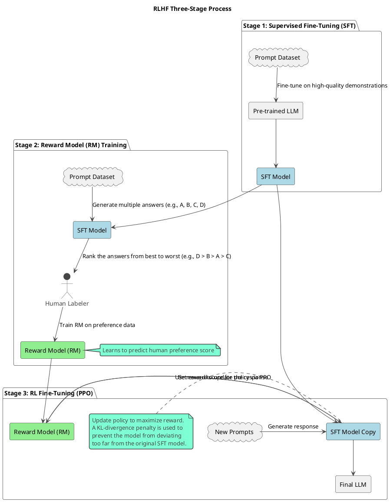

# 6.2 人类反馈强化学习 (RLHF)

RLHF (Reinforcement Learning from Human Feedback) 旨在通过人类的偏好数据，使模型的输出更符合期望（更有用、更无害、更真实）。它是一个多阶段的复杂流程。

RLHF 旨在让模型的输出更符合人类的偏好和价值观。

*   **核心流程**:
    1.  **训练奖励模型 (Reward Model, RM)**: 使用人类对模型不同输出的排序数据，训练一个评估模型输出质量的奖励模型。
    2.  **通过强化学习微调 LLM**: 使用 PPO (Proximal Policy Optimization) 等强化学习算法，利用奖励模型作为回报信号，微调 SFT 模型。
*   **关键概念**: 
    *   奖励模型的设计与偏差
    *   PPO 算法细节
    *   KL 散度惩罚项
*   **DPO (Direct Preference Optimization)**: 作为 RLHF 的一种更简单、更稳定的替代方案。