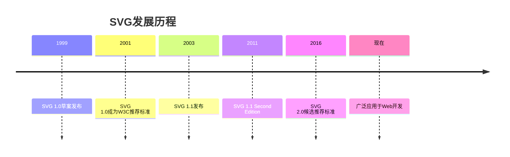

# SVG基础概念

> 深入理解SVG的核心概念，为掌握矢量图形技术打下坚实基础。

## 🎯 学习目标

通过本章学习，您将掌握：
- SVG的定义、历史和发展
- SVG相比其他图形格式的优势
- SVG坐标系统和视口概念
- SVG文档结构和命名空间
- 不同的SVG嵌入方式及其适用场景

## 📚 什么是SVG

### SVG的定义
**SVG（Scalable Vector Graphics）** 是一种基于XML的矢量图形格式，由W3C制定和维护。

#### 核心特征
- **矢量化**：基于数学描述的图形，无限缩放不失真
- **XML格式**：基于标准XML语法，易于理解和编辑
- **Web原生**：被所有现代浏览器原生支持
- **可编程**：可通过CSS和JavaScript控制
- **文本格式**：可读的文本格式，便于版本控制

### SVG的历史


## 🔍 SVG vs 其他图形格式

### 与位图格式对比

| 特性 | SVG | PNG/JPG/GIF |
|------|-----|-------------|
| **缩放性** | ✅ 无限缩放不失真 | ❌ 放大会模糊 |
| **文件大小** | 简单图形更小 | 复杂图像更小 |
| **编辑性** | ✅ 可编程控制 | ❌ 需要图像编辑器 |
| **搜索性** | ✅ 文本可搜索 | ❌ 内容无法搜索 |
| **动画** | ✅ 原生支持 | ❌ 需要多帧 |
| **浏览器支持** | ✅ 现代浏览器 | ✅ 所有浏览器 |

### 与Canvas对比

| 特性 | SVG | Canvas |
|------|-----|--------|
| **DOM集成** | ✅ DOM元素 | ❌ 单个画布元素 |
| **事件处理** | ✅ 元素级事件 | ❌ 需要手动处理 |
| **可访问性** | ✅ 语义化支持 | ❌ 需要额外处理 |
| **性能** | 少量元素更好 | 大量元素更好 |
| **复杂度** | 简单图形 | 复杂渲染 |

### 适用场景

#### SVG最适合：
- 🎯 **图标和Logo** - 需要多尺寸显示
- 📊 **数据可视化** - 图表、图形
- 🎨 **简单插图** - 扁平化设计
- 🖼️ **装饰图案** - 重复图案
- 🎮 **简单动画** - UI动效

#### 不适合SVG：
- 📷 **照片** - 复杂的真实图像
- 🎮 **复杂游戏** - 大量动态元素
- 🎬 **视频内容** - 动态视频内容

## 📐 坐标系统与视口

### SVG坐标系统

#### 基本概念
```svg
<svg width="300" height="200" xmlns="http://www.w3.org/2000/svg">
  <!-- SVG坐标系统演示 -->
  <defs>
    <style>
      .grid-line { stroke: #ddd; stroke-width: 1; }
      .axis-line { stroke: #333; stroke-width: 2; }
      .point { fill: red; }
      .label { font-size: 12px; fill: #333; }
    </style>
  </defs>
  
  <!-- 网格线 -->
  <g class="grid">
    <!-- 垂直线 -->
    <line x1="0" y1="0" x2="0" y2="200" class="axis-line"/>
    <line x1="50" y1="0" x2="50" y2="200" class="grid-line"/>
    <line x1="100" y1="0" x2="100" y2="200" class="grid-line"/>
    <line x1="150" y1="0" x2="150" y2="200" class="grid-line"/>
    <line x1="200" y1="0" x2="200" y2="200" class="grid-line"/>
    <line x1="250" y1="0" x2="250" y2="200" class="grid-line"/>
    <line x1="300" y1="0" x2="300" y2="200" class="grid-line"/>
    
    <!-- 水平线 -->
    <line x1="0" y1="0" x2="300" y2="0" class="axis-line"/>
    <line x1="0" y1="50" x2="300" y2="50" class="grid-line"/>
    <line x1="0" y1="100" x2="300" y2="100" class="grid-line"/>
    <line x1="0" y1="150" x2="300" y2="150" class="grid-line"/>
    <line x1="0" y1="200" x2="300" y2="200" class="grid-line"/>
  </g>
  
  <!-- 坐标点 -->
  <circle cx="0" cy="0" r="3" class="point"/>
  <text x="5" y="15" class="label">(0,0)</text>
  
  <circle cx="100" cy="50" r="3" class="point"/>
  <text x="105" y="45" class="label">(100,50)</text>
  
  <circle cx="200" cy="150" r="3" class="point"/>
  <text x="205" y="145" class="label">(200,150)</text>
  
  <!-- 坐标轴标签 -->
  <text x="280" y="15" class="label">X轴</text>
  <text x="5" y="190" class="label">Y轴</text>
</svg>
```

#### 关键特点
- **原点位置**：左上角 (0,0)
- **X轴方向**：从左到右递增
- **Y轴方向**：从上到下递增（与数学坐标系相反）
- **单位**：默认为像素，也可以使用其他单位

### 视口（Viewport）

#### 基本语法
```svg
<svg width="200" height="150" viewBox="0 0 400 300">
  <!-- 内容会被缩放以适应视口 -->
</svg>
```

#### viewBox详解
```
viewBox="min-x min-y width height"
```

- **min-x, min-y**：视口左上角在用户坐标系中的位置
- **width, height**：视口在用户坐标系中的尺寸

#### 实际示例
```svg
<!-- 示例1：正常视口 -->
<svg width="200" height="100" viewBox="0 0 200 100">
  <rect x="50" y="25" width="100" height="50" fill="blue"/>
</svg>

<!-- 示例2：放大效果 -->
<svg width="200" height="100" viewBox="0 0 100 50">
  <rect x="25" y="12.5" width="50" height="25" fill="red"/>
</svg>

<!-- 示例3：偏移视口 -->
<svg width="200" height="100" viewBox="50 25 100 50">
  <rect x="75" y="37.5" width="50" height="25" fill="green"/>
</svg>
```

### preserveAspectRatio

控制viewBox如何映射到viewport：

```svg
<!-- 保持比例，居中对齐 -->
<svg width="200" height="100" viewBox="0 0 100 100" preserveAspectRatio="xMidYMid meet">
  <circle cx="50" cy="50" r="40" fill="orange"/>
</svg>

<!-- 不保持比例，拉伸填充 -->
<svg width="200" height="100" viewBox="0 0 100 100" preserveAspectRatio="none">
  <circle cx="50" cy="50" r="40" fill="purple"/>
</svg>
```

## 🏗️ SVG文档结构

### 基本结构
```svg
<?xml version="1.0" encoding="UTF-8"?>
<svg xmlns="http://www.w3.org/2000/svg" 
     width="300" height="200" 
     viewBox="0 0 300 200">
  
  <!-- 样式定义 -->
  <defs>
    <style>
      .my-class { fill: blue; }
    </style>
  </defs>
  
  <!-- 图形内容 -->
  <rect x="50" y="50" width="200" height="100" class="my-class"/>
  
</svg>
```

### 命名空间详解

#### 基本命名空间
```svg
<svg xmlns="http://www.w3.org/2000/svg">
  <!-- SVG内容 -->
</svg>
```

#### 扩展命名空间
```svg
<svg xmlns="http://www.w3.org/2000/svg"
     xmlns:xlink="http://www.w3.org/1999/xlink">
  <!-- 可以使用xlink属性 -->
</svg>
```

### 文档元数据
```svg
<svg xmlns="http://www.w3.org/2000/svg" viewBox="0 0 100 100">
  <title>我的SVG图标</title>
  <desc>这是一个用于演示的简单图标</desc>
  
  <!-- 图形内容 -->
  <circle cx="50" cy="50" r="40" fill="blue"/>
</svg>
```

## 🔗 SVG嵌入方式

### 1. 内联SVG（推荐）

#### 语法
```html
<!DOCTYPE html>
<html>
<head>
    <title>内联SVG示例</title>
</head>
<body>
    <svg width="100" height="100">
        <circle cx="50" cy="50" r="40" fill="red"/>
    </svg>
</body>
</html>
```

#### 优势
- ✅ 完全可控性（CSS、JavaScript）
- ✅ 最佳性能（无需额外请求）
- ✅ 可访问性支持
- ✅ 可以内联样式

#### 劣势
- ❌ 增加HTML文件大小
- ❌ 无法缓存
- ❌ 不适合大型SVG

### 2. 作为图片使用

#### 语法
```html

```

#### 优势
- ✅ 可缓存
- ✅ 简单易用
- ✅ 不增加HTML大小

#### 劣势
- ❌ 无法用CSS控制样式
- ❌ 无法JavaScript交互
- ❌ 需要额外HTTP请求

### 3. CSS背景图

#### 语法
```css
.icon {
    background-image: url('icon.svg');
    background-size: contain;
    background-repeat: no-repeat;
    width: 100px;
    height: 100px;
}
```

#### 优势
- ✅ 可缓存
- ✅ CSS控制显示
- ✅ 适合装饰性图形

#### 劣势
- ❌ 无法JavaScript交互
- ❌ 可访问性限制

### 4. Object/Embed元素

#### 语法
```html
<object data="icon.svg" type="image/svg+xml" width="100" height="100">
    <!-- 降级内容 -->
    
</object>
```

#### 特点
- 可以保持SVG的交互性
- 有降级机制
- 比较少用

## 🛠️ 实践练习

### 练习1：创建第一个SVG
创建一个简单的SVG，包含：
- 设置合适的宽高和viewBox
- 添加标题和描述
- 绘制一个圆形和文本

```svg
<svg xmlns="http://www.w3.org/2000/svg" 
     width="200" height="200" 
     viewBox="0 0 200 200">
  
  <title>我的第一个SVG</title>
  <desc>包含圆形和文本的简单SVG</desc>
  
  <circle cx="100" cy="80" r="50" fill="#4CAF50"/>
  <text x="100" y="160" text-anchor="middle" font-size="16" fill="#333">
    Hello SVG!
  </text>
  
</svg>
```

### 练习2：理解坐标系统
创建一个坐标系统演示：

```svg
<svg width="300" height="200" viewBox="0 0 300 200">
  <title>坐标系统演示</title>
  
  <!-- 坐标轴 -->
  <line x1="0" y1="100" x2="300" y2="100" stroke="#333" stroke-width="1"/>
  <line x1="150" y1="0" x2="150" y2="200" stroke="#333" stroke-width="1"/>
  
  <!-- 象限点 -->
  <circle cx="200" cy="50" r="5" fill="red"/>
  <text x="205" y="45">第一象限</text>
  
  <circle cx="100" cy="50" r="5" fill="blue"/>
  <text x="50" y="45">第二象限</text>
  
  <circle cx="100" cy="150" r="5" fill="green"/>
  <text x="50" y="170">第三象限</text>
  
  <circle cx="200" cy="150" r="5" fill="orange"/>
  <text x="205" y="170">第四象限</text>
</svg>
```

### 练习3：ViewBox实验
创建三个相同内容但不同viewBox的SVG：

```svg
<!-- 原始大小 -->
<svg width="150" height="100" viewBox="0 0 150 100">
  <rect x="25" y="25" width="100" height="50" fill="blue"/>
</svg>

<!-- 放大2倍 -->
<svg width="150" height="100" viewBox="0 0 75 50">
  <rect x="12.5" y="12.5" width="50" height="25" fill="red"/>
</svg>

<!-- 部分视图 -->
<svg width="150" height="100" viewBox="25 25 100 50">
  <rect x="50" y="37.5" width="50" height="25" fill="green"/>
</svg>
```

## ❓ 常见问题

### Q1: SVG在不同浏览器中显示不一致？
**A**: 检查以下几点：
- 是否设置了正确的命名空间
- 是否使用了浏览器不支持的特性
- 是否有CSS样式冲突

### Q2: SVG文件太大怎么办？
**A**: 优化方法：
- 移除不必要的元数据
- 简化路径
- 使用SVGO等工具压缩
- 考虑是否适合用SVG

### Q3: 如何让SVG响应式？
**A**: 方法：
- 移除固定的width和height属性
- 设置viewBox
- 用CSS控制容器大小

### Q4: SVG中的文本无法选择？
**A**: 确保：
- 没有设置pointer-events: none
- 文本元素没有被其他元素覆盖
- 使用了适当的user-select CSS属性

## 🎯 本章小结

通过本章学习，您应该掌握：

### ✅ 核心概念
- SVG的定义和特点
- SVG与其他格式的区别
- 适用场景的判断

### ✅ 技术基础
- 坐标系统的理解
- viewBox和viewport的关系
- 文档结构和命名空间

### ✅ 实践技能
- 选择合适的嵌入方式
- 创建基本的SVG文档
- 理解并应用视口概念

## 📖 拓展阅读

- [SVG规范文档](https://www.w3.org/TR/SVG2/) - W3C官方规范
- [SVG坐标系统详解](https://developer.mozilla.org/zh-CN/docs/Web/SVG/Tutorial/Positions) - MDN教程
- [SVG优化指南](https://web.dev/optimize-svg/) - Google Web.dev

---

🎯 **下一步**：继续学习 [基本图形绘制](02-basic-shapes.md)，开始创建具体的图形元素！ 