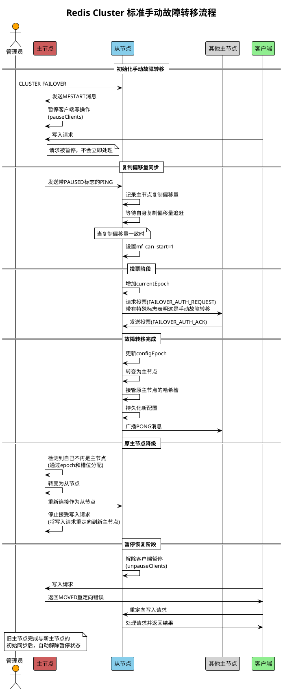
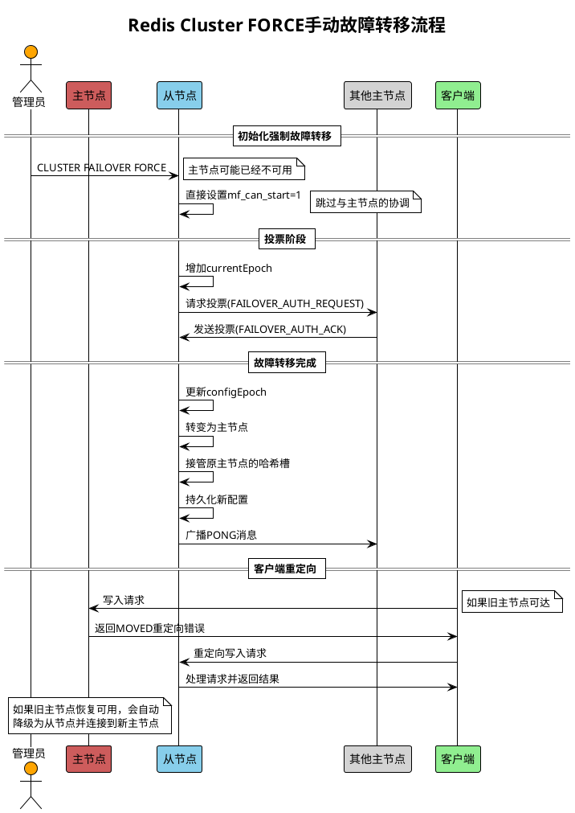
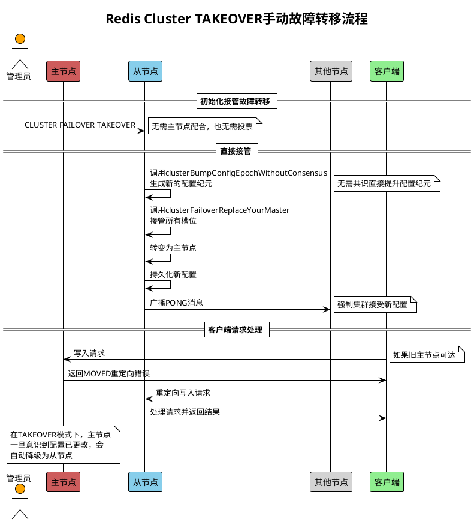

# Redis集群主动故障转移流程图

以下是Redis集群主动故障转移过程的PlantUML序列图，分别展示了三种不同类型的手动故障转移流程。

## 标准手动故障转移序列图

## FORCE手动故障转移序列图

## TAKEOVER手动故障转移序列图

## 各类主动故障转移比较

| 类型 | 与主节点协调 | 需要投票 | 旧主节点暂停 | 用途 |
|------|------------|---------|------------|------|
| 标准模式 | 是 | 是 | 是 | 常规维护，数据一致性高 |
| FORCE模式 | 否 | 是 | 否 | 主节点响应缓慢但可达 |
| TAKEOVER模式 | 否 | 否 | 否 | 紧急情况，集群无法正常工作 |

## 客户端暂停和恢复流程

在标准手动故障转移中，客户端暂停和恢复的详细流程如下：

1. **暂停阶段**：
   - 主节点接收到从节点的MFSTART消息后调用pauseClients()
   - 客户端的写请求被延迟处理，不会立即执行
   - 在暂停期间，主节点仍能接收读请求（取决于暂停类型）

2. **角色切换阶段**：
   - 当新主节点完成选举和槽位接管后，旧主节点会收到集群状态更新
   - 旧主节点会检测到自己的槽位被重新分配和配置纪元的变化
   - 旧主节点会自动将自己降级为从节点

3. **恢复阶段**：
   - 新主节点完成晋升后，调用unpauseClients()解除暂停
   - 旧主节点（现从节点）与新主节点建立复制连接
   - 旧主节点完成与新主节点的初始同步后，也会解除暂停状态
   - 旧主节点收到的写请求会返回MOVED重定向错误，引导客户端连接新主节点

所有这些机制确保了在故障转移过程中数据的一致性和高可用性。 