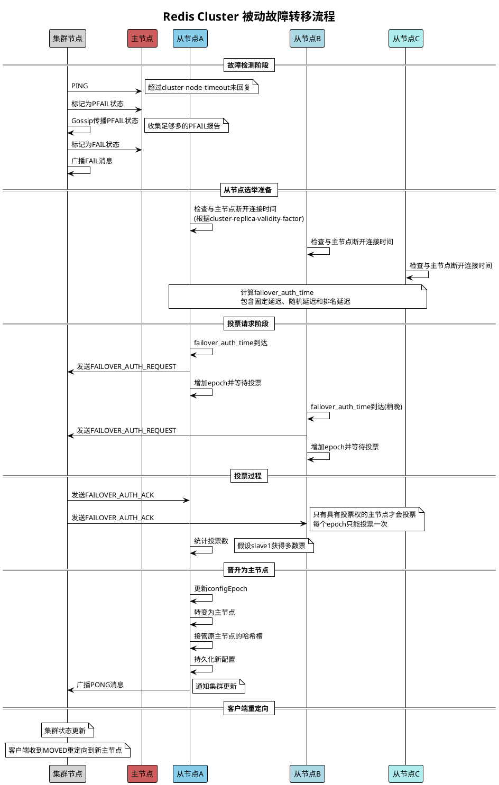

# Redis集群被动故障转移流程图

以下是Redis集群被动故障转移过程的PlantUML序列图，详细展示了整个自动故障转移的流程。

## 被动故障转移实现关键点

1. **PFAIL到FAIL状态转换**：需要超过半数主节点报告节点PFAIL才会将其标记为FAIL
2. **选举延迟计算**：通过特定算法确定从节点开始选举的时间点
3. **投票权**：只有处于正常状态的主节点有投票权
4. **多数投票原则**：需要获得超过半数主节点的投票才能当选
5. **状态广播**：通过PONG消息广播新的集群状态 