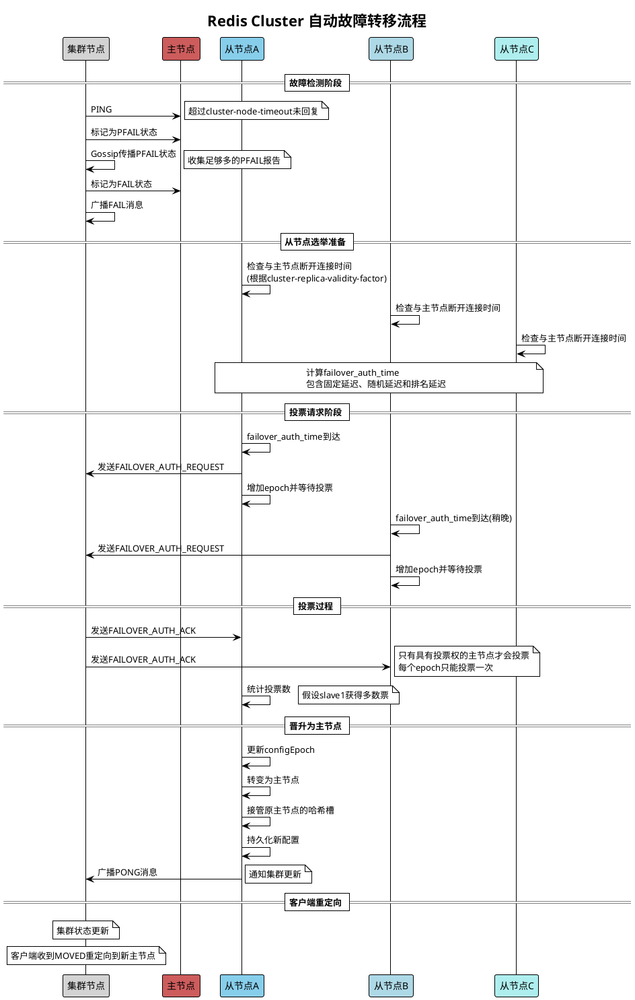
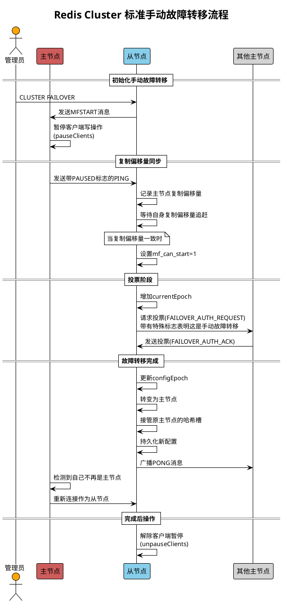
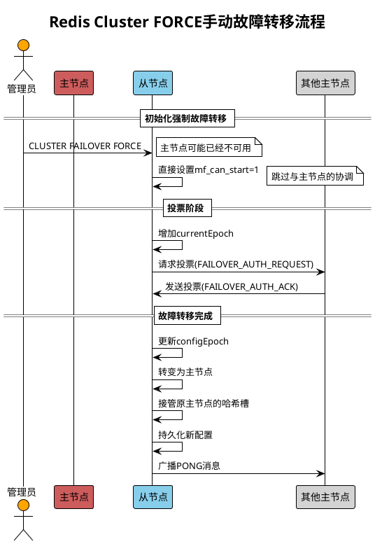
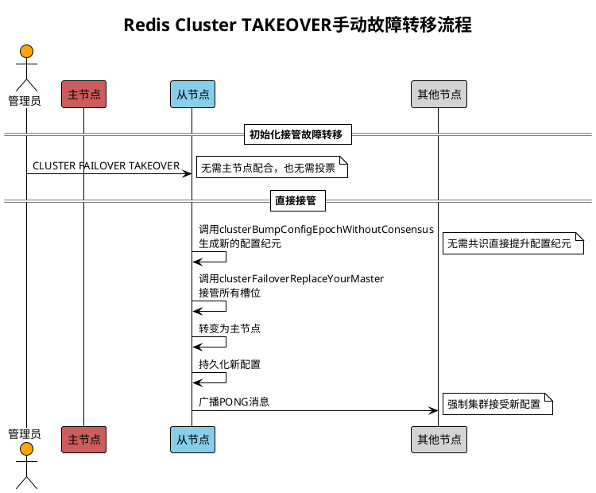

# Redis集群故障转移流程图

以下是Redis集群故障转移过程的PlantUML序列图，分别展示了自动故障转移和手动故障转移的流程。

## 自动故障转移序列图

```plantuml
@startuml
!theme plain
title Redis Cluster 自动故障转移流程

participant "集群节点" as nodes #LightGray
participant "主节点" as master #IndianRed
participant "从节点A" as slave1 #SkyBlue
participant "从节点B" as slave2 #LightBlue
participant "从节点C" as slave3 #PaleTurquoise

== 故障检测阶段 ==

nodes -> master : PING
note right: 超过cluster-node-timeout未回复
nodes -> master : 标记为PFAIL状态
nodes -> nodes : Gossip传播PFAIL状态
note right: 收集足够多的PFAIL报告
nodes -> master : 标记为FAIL状态
nodes -> nodes : 广播FAIL消息

== 从节点选举准备 ==

slave1 -> slave1 : 检查与主节点断开连接时间\n(根据cluster-replica-validity-factor)
slave2 -> slave2 : 检查与主节点断开连接时间
slave3 -> slave3 : 检查与主节点断开连接时间
note over slave1, slave3 : 计算failover_auth_time\n包含固定延迟、随机延迟和排名延迟

== 投票请求阶段 ==

slave1 -> slave1 : failover_auth_time到达
slave1 -> nodes : 发送FAILOVER_AUTH_REQUEST
slave1 -> slave1 : 增加epoch并等待投票

slave2 -> slave2 : failover_auth_time到达(稍晚)
slave2 -> nodes : 发送FAILOVER_AUTH_REQUEST
slave2 -> slave2 : 增加epoch并等待投票

== 投票过程 ==

nodes -> slave1 : 发送FAILOVER_AUTH_ACK
nodes -> slave2 : 发送FAILOVER_AUTH_ACK
note right : 只有具有投票权的主节点才会投票\n每个epoch只能投票一次

slave1 -> slave1 : 统计投票数
note right : 假设slave1获得多数票

== 晋升为主节点 ==

slave1 -> slave1 : 更新configEpoch
slave1 -> slave1 : 转变为主节点
slave1 -> slave1 : 接管原主节点的哈希槽
slave1 -> slave1 : 持久化新配置
slave1 -> nodes : 广播PONG消息
note right: 通知集群更新

== 客户端重定向 ==

note over nodes : 集群状态更新
note over nodes : 客户端收到MOVED重定向到新主节点
@enduml
```

## 标准手动故障转移序列图

```plantuml
@startuml
!theme plain
title Redis Cluster 标准手动故障转移流程

actor "管理员" as admin #Orange
participant "主节点" as master #IndianRed
participant "从节点" as slave #SkyBlue
participant "其他主节点" as otherMasters #LightGray

== 初始化手动故障转移 ==

admin -> slave : CLUSTER FAILOVER
slave -> master : 发送MFSTART消息
master -> master : 暂停客户端写操作\n(pauseClients)

== 复制偏移量同步 ==

master -> slave : 发送带PAUSED标志的PING
slave -> slave : 记录主节点复制偏移量
slave -> slave : 等待自身复制偏移量追赶

note over slave : 当复制偏移量一致时
slave -> slave : 设置mf_can_start=1

== 投票阶段 ==

slave -> slave : 增加currentEpoch
slave -> otherMasters : 请求投票(FAILOVER_AUTH_REQUEST)\n带有特殊标志表明这是手动故障转移
otherMasters -> slave : 发送投票(FAILOVER_AUTH_ACK)

== 故障转移完成 ==

slave -> slave : 更新configEpoch
slave -> slave : 转变为主节点
slave -> slave : 接管原主节点的哈希槽
slave -> slave : 持久化新配置
slave -> otherMasters : 广播PONG消息

master -> master : 检测到自己不再是主节点
master -> slave : 重新连接作为从节点

== 完成后操作 ==

slave -> slave : 解除客户端暂停\n(unpauseClients)
@enduml
```

## FORCE手动故障转移序列图

```plantuml
@startuml
!theme plain
title Redis Cluster FORCE手动故障转移流程

actor "管理员" as admin #Orange
participant "主节点" as master #IndianRed
participant "从节点" as slave #SkyBlue
participant "其他主节点" as otherMasters #LightGray

== 初始化强制故障转移 ==

admin -> slave : CLUSTER FAILOVER FORCE
note right : 主节点可能已经不可用

slave -> slave : 直接设置mf_can_start=1
note right : 跳过与主节点的协调

== 投票阶段 ==

slave -> slave : 增加currentEpoch
slave -> otherMasters : 请求投票(FAILOVER_AUTH_REQUEST)
otherMasters -> slave : 发送投票(FAILOVER_AUTH_ACK)

== 故障转移完成 ==

slave -> slave : 更新configEpoch
slave -> slave : 转变为主节点
slave -> slave : 接管原主节点的哈希槽
slave -> slave : 持久化新配置
slave -> otherMasters : 广播PONG消息
@enduml
```

## TAKEOVER手动故障转移序列图

```plantuml
@startuml
!theme plain
title Redis Cluster TAKEOVER手动故障转移流程

actor "管理员" as admin #Orange
participant "主节点" as master #IndianRed
participant "从节点" as slave #SkyBlue
participant "其他节点" as others #LightGray

== 初始化接管故障转移 ==

admin -> slave : CLUSTER FAILOVER TAKEOVER
note right : 无需主节点配合，也无需投票

== 直接接管 ==

slave -> slave : 调用clusterBumpConfigEpochWithoutConsensus\n生成新的配置纪元
note right : 无需共识直接提升配置纪元
slave -> slave : 调用clusterFailoverReplaceYourMaster\n接管所有槽位
slave -> slave : 转变为主节点
slave -> slave : 持久化新配置
slave -> others : 广播PONG消息
note right : 强制集群接受新配置
@enduml
``` 