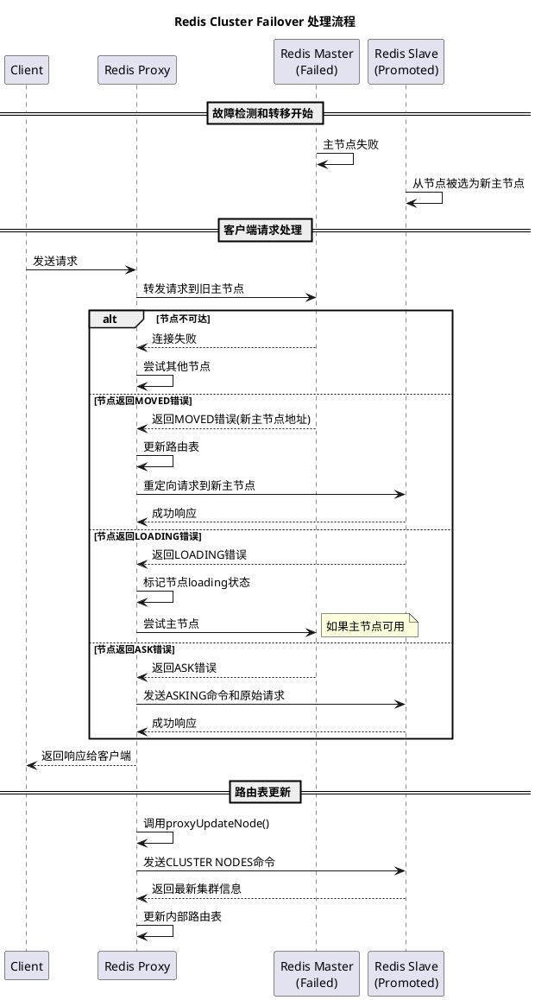
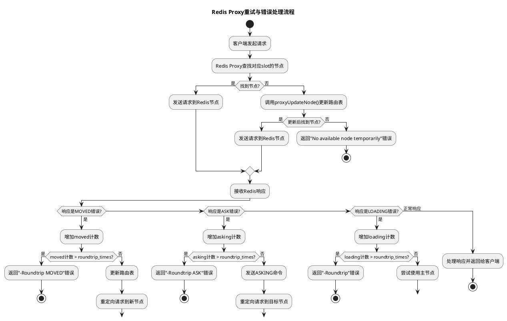

# Redis集群故障转移(Failover)期间的行为分析

## 1. 概述

本文档详细描述了Redis集群进行故障转移(Failover)过程中，Redis Proxy的处理机制和客户端的表现。Redis Proxy作为客户端和Redis集群之间的中间层，在故障转移过程中扮演着至关重要的角色，使得故障转移对客户端尽可能透明。

## 2. Redis故障转移基本概念

Redis集群故障转移是指当一个主节点(master)不可用时，Redis集群自动将其中一个从节点(slave)提升为新的主节点，并更新集群状态，确保服务可以继续运行的过程。故障转移通常由以下事件触发：

- 主节点故障（崩溃或网络分区）
- 手动触发的故障转移（用于维护）

## 3. Redis Proxy在故障转移过程中的行为

### 3.1 错误识别和处理

Redis Proxy能够识别并处理以下与故障转移相关的错误响应：

- `LOADING` - 表示节点正在加载数据，通常是从RDB或AOF文件恢复
- `MASTERDOWN` - 表示从节点无法连接到主节点
- `MOVED` - 表示请求的数据槽已迁移到另一个节点
- `ASK` - 表示数据槽正在迁移过程中

### 3.2 请求重定向

当Proxy收到上述错误时，会采取相应的重定向策略：

- 对于`LOADING`或`MASTERDOWN`错误：将请求重定向到主节点
- 对于`MOVED`错误：更新路由表并重定向请求
- 对于`ASK`错误：临时将请求重定向到目标节点，但不更新路由表

### 3.3 路由表更新

Proxy通过以下方式保持路由表的最新状态：

- 定期（通过`proxyUpdateNodeCron`）向Redis节点发送`CLUSTER NODES`命令
- 当收到`MOVED`错误时，触发`proxyUpdateNode()`更新路由表
- 根据最新的集群拓扑信息调整路由表

### 3.4 重试机制

Proxy实现了有限重试机制：

- 使用`proxy.roundtrip_times`控制最大重试次数
- 对不同类型的错误（LOADING、MOVED、ASK）分别计数
- 达到最大重试次数时，向客户端返回相应的错误消息

## 4. 客户端在故障转移过程中的表现

### 4.1 透明故障处理

对客户端而言，大多数故障转移过程是透明的：

- 客户端不需要了解集群拓扑结构
- 不需要手动重定向请求
- 大多数情况下无需特殊的错误处理代码

### 4.2 性能影响

故障转移过程中，客户端可能会观察到：

- 请求延迟增加（由于重定向和重试）
- 在极端情况下（多次重定向失败）请求失败

### 4.3 错误情况

如果故障转移过程出现问题，客户端可能会收到以下错误：

- `-REDIS_CONN No available node temporarily` - 找不到可用节点
- `-Roundtrip MOVED` - MOVED重定向次数过多
- `-Roundtrip ASK` - ASK重定向次数过多
- `-Roundtrip` - LOADING重试次数过多

## 5. 故障转移流程图

## 6. 重试与错误处理流程

## 7. 总结

Redis集群故障转移过程中，Redis Proxy充当客户端和Redis集群之间的智能中间层，通过以下机制确保服务的高可用性：

1. 自动处理各种错误状态和重定向
2. 动态更新路由表以适应集群拓扑变化
3. 提供有限重试机制，减少客户端失败率
4. 详细记录故障和重定向历史，便于问题排查

对客户端而言，故障转移过程通常是透明的，只有在极端情况下才会感知到服务中断，这极大地简化了客户端的实现，提高了系统的可用性和用户体验。

## 8. 注意事项

- 重试次数(`proxy.roundtrip_times`)的设置需要权衡重试带来的延迟和成功率
- 大型集群进行故障转移时，路由表更新可能会对Proxy性能产生短暂影响
- 在高流量场景下，故障转移可能导致请求临时堆积，需要合理设置缓冲区大小 